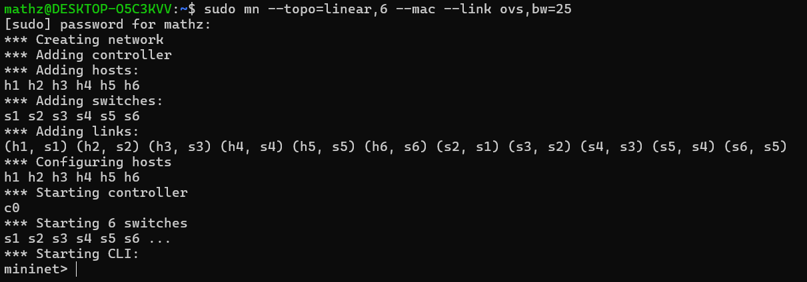
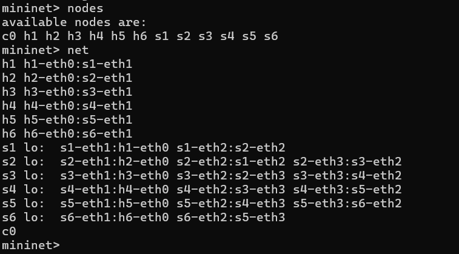

# Trabalho de Redes com Mininet

## Topologia Linear com 6 Switches

### 1. Criação da Topologia

Com uso de linha de comando padrão do Mininet, crie a topologia considerando o endereço MAC padronizado, larguras de banda bw de 25Mbps e controlador do Mininet (não precisa especificar):

```bash
sudo mn --topo=linear,6 --mac --link ovs,bw=25
```

---

### 2. Inspeção das Interfaces

Inspecione informações das interfaces, endereços MAC, IP e portas através de linhas de comando:

- Ver a lista de nós disponíveis na topologia:

```bash
nodes
```

- Ver a conexão entre os nós (hosts e switches):

```bash
net
```

- Ver endereços IP e MAC de um host:

```bash
h1 ifconfig -a
```

- Ver interfaces de um switch:

```bash
s1 ifconfig -a
```

---

### 3. Testes de Conectividade (Ping)

Execute testes de ping entre os diferentes nós:

- Ping entre todos os nós automaticamente:

```bash
pingall
```

---

### 4. Teste de Desempenho com iPerf

- Especifique o **host 1 (h1)** como servidor TCP na porta **5555**:

```bash
h1 iperf -s -p 5555 -i 1
```

- Especifique o **host 2 (h2)** como cliente, conectando-se ao servidor, com relatório a cada 1 segundo por 15 segundos:

```bash
h2 iperf -c 10.0.0.2 -p 5555 -i 1 -t 15
```

---



